# MENTIS CURA — Documentación de Diagramas UML

**Sistema de Monitoreo Psicológico**
**Proyecto de Tesis — 2024**

---

## Tabla de Contenidos

1. [Descripción General del Sistema](#1-descripción-general-del-sistema)
2. [Diagrama de Contexto](#2-diagrama-de-contexto)
3. [Diagrama de Casos de Uso](#3-diagrama-de-casos-de-uso)
4. [Diagrama de Clases](#4-diagrama-de-clases)
5. [Diagrama Entidad-Relación (Base de Datos)](#5-diagrama-entidad-relación-base-de-datos)
6. [Diagrama de Componentes](#6-diagrama-de-componentes)
7. [Diagramas de Secuencia](#7-diagramas-de-secuencia)
   - 7.1 [Autenticación (Login)](#71-autenticación-login)
   - 7.2 [Registro de Discente](#72-registro-de-discente)
   - 7.3 [Responder Cuestionario y Generar Evaluación](#73-responder-cuestionario-y-generar-evaluación)
   - 7.4 [Generación Automática de Alertas](#74-generación-automática-de-alertas)
   - 7.5 [Atención de Alerta por Orientador](#75-atención-de-alerta-por-orientador)
8. [Diagrama de Actividades](#8-diagrama-de-actividades)
   - 8.1 [Proceso de Evaluación PHQ-9](#81-proceso-de-evaluación-phq-9)
   - 8.2 [Clasificación de Nivel de Riesgo](#82-clasificación-de-nivel-de-riesgo)
9. [Diagrama de Estados](#9-diagrama-de-estados)
   - 9.1 [Estados de una Alerta](#91-estados-de-una-alerta)
   - 9.2 [Ciclo de Vida de una Evaluación](#92-ciclo-de-vida-de-una-evaluación)
10. [Diagrama de Paquetes](#10-diagrama-de-paquetes)
11. [Ruta Ideal del Sistema](#11-ruta-ideal-del-sistema)
    - 11.1 [Ruta Ideal — Discente](#111-ruta-ideal--discente)
    - 11.2 [Ruta Ideal — Orientador](#112-ruta-ideal--orientador)
    - 11.3 [Mapa completo de URLs](#113-mapa-completo-de-urls)

---

## 1. Descripción General del Sistema

**MENTIS CURA** es una aplicación web de tamizaje psicológico desarrollada con el framework Flask (Python). Su propósito es facilitar la aplicación de cuestionarios estandarizados de salud mental a discentes (estudiantes) de una institución, y notificar automáticamente al personal autorizado (orientadores y administradores) cuando los resultados sugieren riesgo.

### Actores del sistema

| Actor | Descripción |
|---|---|
| **Discente** | Estudiante que responde cuestionarios y consulta sus resultados. Usa su matrícula como nombre de usuario. |
| **Orientador (Psicólogo)** | Personal de salud mental que revisa alertas, consulta evaluaciones y atiende casos. |
| **Administrador** | Tiene acceso completo al sistema, incluyendo la gestión de usuarios y configuración. |

### Instrumentos de tamizaje implementados

| Instrumento | Preguntas | Puntaje | Propósito |
|---|---|---|---|
| **PHQ-2** | 2 | 0–6 | Tamizaje rápido de depresión |
| **PHQ-9** | 9 | 0–27 | Evaluación completa de depresión |
| **ASSIST** | Variable | Por sustancia | Consumo de sustancias (9 tipos) |

### Stack tecnológico

- **Backend**: Python 3.9, Flask 3.0
- **ORM**: SQLAlchemy 2.0 / Flask-SQLAlchemy
- **Autenticación**: Flask-Login 0.6
- **Seguridad CSRF**: Flask-WTF
- **Base de datos**: SQLite (desarrollo) / compatible con PostgreSQL
- **Arquitectura**: MVC con patrón Application Factory y Blueprints

---

## 2. Diagrama de Contexto

El **diagrama de contexto** (también llamado diagrama de nivel 0 o DFD de contexto) representa el sistema completo como una caja negra, mostrando únicamente qué entidades externas interactúan con él y qué flujos de información entran y salen. No muestra el interior del sistema ni sus módulos.

```
                        ╔══════════════════════════════╗
                        ║                              ║
   [Discente] ─────────>║  Credenciales de acceso      ║
              <─────────║  Formularios de cuestionario  ║
                        ║  Resultados de evaluación     ║
                        ║  Historial personal           ║
                        ║                              ║
   [Orientador]────────>║  Credenciales de acceso      ║
               <────────║  Listado de alertas           ║
                        ║  Detalle de alertas           ║       ┌─────────────────┐
                        ║  Historial de discentes       ║<─────>│  Base de Datos  │
                        ║  Estadísticas del sistema     ║       │  (SQLite)       │
                        ║                              ║       └─────────────────┘
   [Administrador]─────>║  Credenciales de acceso      ║
                 <──────║  Gestión de usuarios          ║
                        ║  Panel de administración      ║
                        ║  Toda la info de orientador   ║
                        ║                              ║
                        ║    S I S T E M A             ║
                        ║    MENTIS  CURA              ║
                        ╚══════════════════════════════╝
```

### Versión formal con Mermaid

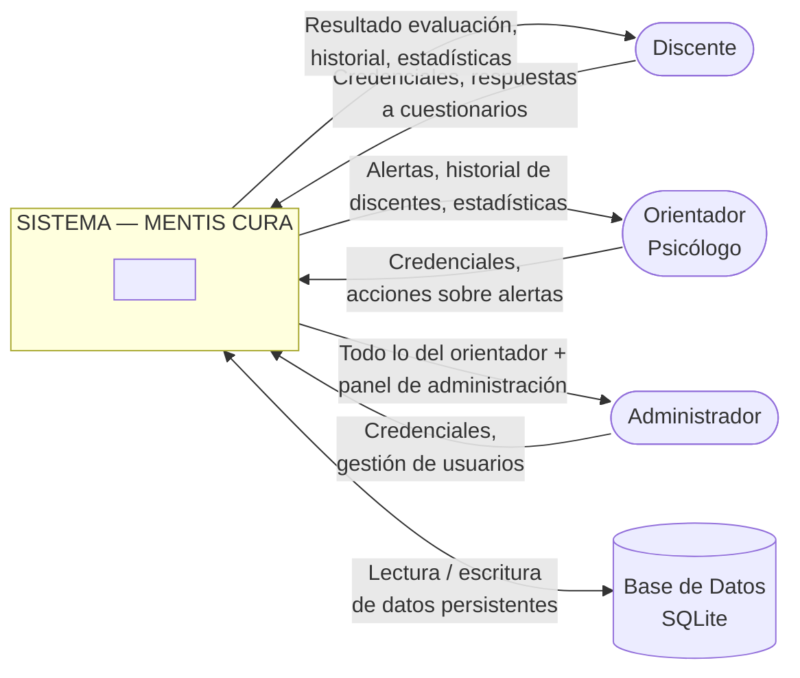

### Entidades externas y su rol

| Entidad externa | Tipo | Entradas al sistema | Salidas del sistema |
|---|---|---|---|
| **Discente** | Actor humano | Credenciales de login, matrícula (registro), respuestas a cuestionarios | Resultado de evaluación (puntaje, nivel de riesgo), historial propio, estadísticas personales |
| **Orientador (Psicólogo)** | Actor humano | Credenciales de login, filtros de búsqueda, notas de atención, cambios de estado de alerta | Lista de alertas ordenadas por prioridad, detalle de discentes, historial de evaluaciones de cualquier discente, estadísticas globales |
| **Administrador** | Actor humano | Credenciales de login, datos de nuevos usuarios, cambios de configuración | Todo lo del orientador + panel de gestión de usuarios (crear, activar, desactivar) |
| **Base de Datos (SQLite)** | Sistema externo | Consultas SQL (SELECT) y transacciones (INSERT, UPDATE) via SQLAlchemy ORM | Datos persistentes: usuarios, evaluaciones, alertas, respuestas |

### Lo que el sistema NO interactúa con en esta versión

- No envía correos electrónicos (las alertas son solo internas).
- No se integra con sistemas externos de expedientes clínicos.
- No expone una API REST pública.
- No consume servicios de terceros.

---

## 3. Diagrama de Casos de Uso

Muestra las acciones que cada actor puede realizar en el sistema.

```
+--------------------------------------------------------------+
|                      MENTIS CURA                             |
|                                                              |
|  +------------------+    +----------------------------+      |
|  | Discente         |    | Orientador / Admin         |      |
|  |                  |    |                            |      |
|  | UC01: Registrarse|    | UC08: Ver alertas          |      |
|  | UC02: Iniciar    |    | UC09: Filtrar alertas      |      |
|  |        sesión    |    | UC10: Ver detalle alerta   |      |
|  | UC03: Listar     |    | UC11: Marcar en revisión   |      |
|  |   cuestionarios  |    | UC12: Marcar como atendida |      |
|  | UC04: Responder  |    | UC13: Ver evaluación       |      |
|  |   cuestionario   |    |        de discente         |      |
|  | UC05: Ver        |    | UC14: Listar discentes     |      |
|  |   resultado      |    | UC15: Ver historial de     |      |
|  | UC06: Ver        |    |        un discente         |      |
|  |   historial      |    |                            |      |
|  | UC07: Cerrar     |    | (Admin también):           |      |
|  |        sesión    |    | UC16: Gestionar usuarios   |      |
|  +------------------+    | UC17: Crear usuarios       |      |
|                          | UC18: Activar/desactivar   |      |
|                          +----------------------------+      |
|                                                              |
|  Casos de uso del SISTEMA (automáticos):                     |
|  UC-S01: Calcular puntaje total                              |
|  UC-S02: Clasificar nivel de riesgo                          |
|  UC-S03: Detectar pregunta crítica (P9 / Q8)                 |
|  UC-S04: Generar alerta automática                           |
+--------------------------------------------------------------+
```

### Relaciones entre casos de uso

- **UC04 incluye** UC-S01 (al responder un cuestionario, siempre se calcula el puntaje)
- **UC04 incluye** UC-S02 (siempre se clasifica el riesgo)
- **UC04 incluye** UC-S03 (siempre se revisa la pregunta crítica)
- **UC-S03 extiende** UC-S04 (si hay respuesta crítica, se genera alerta)
- **UC-S02 extiende** UC-S04 (si el riesgo es suficiente, se genera alerta)
- **UC05 incluye** UC06 (ver resultado implica acceder al historial del usuario)

---

## 4. Diagrama de Clases

Muestra la estructura de las clases del dominio con sus atributos, métodos y relaciones.

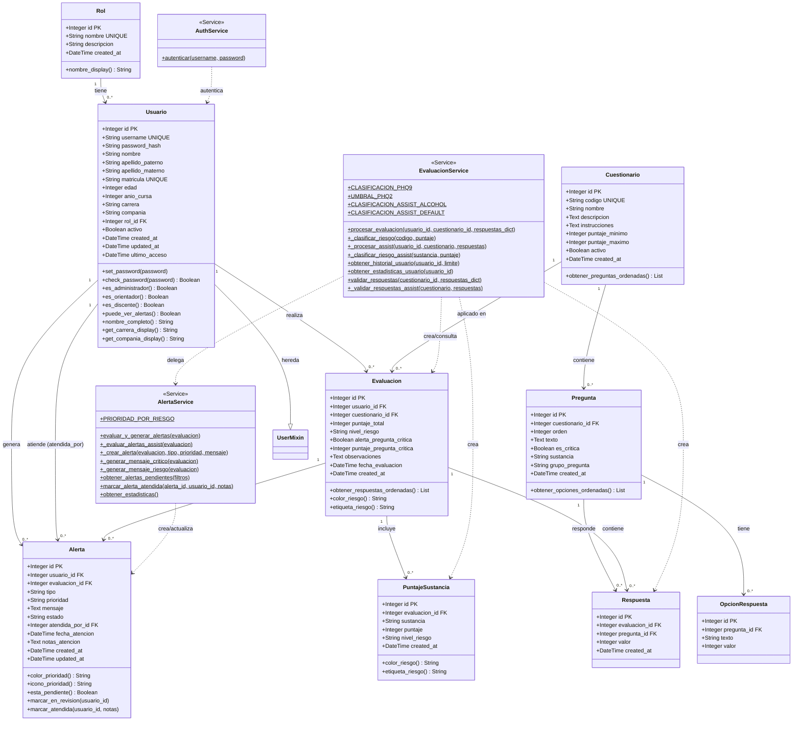

### Notas sobre el diagrama de clases

- `UserMixin` es una clase de Flask-Login que provee los métodos `is_authenticated`, `is_active`, `is_anonymous` y `get_id()` necesarios para el manejo de sesiones.
- Los métodos marcados con `$` en los servicios son métodos de clase (`@classmethod`), no de instancia.
- `EvaluacionService` y `AlertaService` no tienen estado de instancia; actúan como clases de utilidad con métodos de clase.
- Las relaciones `FK` (clave foránea) en los modelos se corresponden directamente con las relaciones `-->` del diagrama.

---

## 5. Diagrama Entidad-Relación (Base de Datos)

Muestra la estructura real de la base de datos con todas las tablas y sus relaciones.

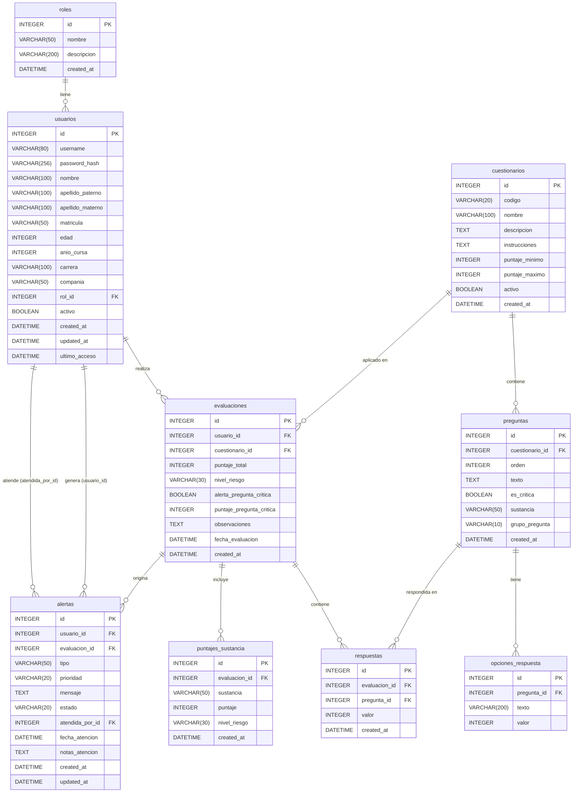

### Descripción de las tablas

| Tabla | Registros típicos | Propósito |
|---|---|---|
| `roles` | 3 fijos (admin, orientador, discente) | Control de acceso basado en roles |
| `usuarios` | N discentes + personal | Todos los usuarios del sistema |
| `cuestionarios` | 3 (PHQ-2, PHQ-9, ASSIST) | Instrumentos de tamizaje |
| `preguntas` | ~30+ | Preguntas de cada instrumento |
| `opciones_respuesta` | ~120+ | Escala Likert por pregunta |
| `evaluaciones` | Creciente con el tiempo | Registro de cada aplicación de cuestionario |
| `respuestas` | N × preguntas por evaluación | Respuestas individuales por pregunta |
| `puntajes_sustancia` | Solo para ASSIST | SSIS calculado por sustancia |
| `alertas` | Subconjunto de evaluaciones | Solo evaluaciones con riesgo significativo |

### Valores de dominio importantes

**`usuarios.carrera`**: `tronco_comun` | `ing_computacion` | `ing_industrial` | `ing_comunicaciones` | `ing_construccion`

**`usuarios.compania`**: `primera` | `segunda` | `tercera` | `cuarta` | `oficiales`

**`evaluaciones.nivel_riesgo`**: `minimo` | `bajo` | `leve` | `riesgo` | `moderado` | `perjudicial` | `moderado_severo` | `alto` | `posible_dependencia` | `severo`

**`alertas.tipo`**: `pregunta_critica` | `puntaje_riesgo`

**`alertas.prioridad`**: `baja` | `media` | `alta` | `critica`

**`alertas.estado`**: `pendiente` | `en_revision` | `atendida`

---

## 6. Diagrama de Componentes

Muestra la arquitectura en capas del sistema y cómo se relacionan sus módulos.

```
+=========================================================================+
|                        CAPA DE PRESENTACIÓN                             |
|                         (Templates HTML + CSS)                          |
|  +---------------+  +----------------+  +-------------+  +----------+  |
|  | auth/         |  | cuestionarios/ |  | evaluaciones|  | alertas/ |  |
|  | login.html    |  | listado.html   |  | resultado   |  | listado  |  |
|  | registro.html |  | responder.html |  | historial   |  | detalle  |  |
|  +---------------+  +----------------+  +-------------+  +----------+  |
+=========================================================================+
                              |  HTTP requests / responses
+=========================================================================+
|                       CAPA DE RUTAS (Blueprints)                        |
|  +----------+  +-------------+  +-------------+  +--------+  +------+  |
|  | auth_bp  |  | cuestion_bp |  | evaluac_bp  |  | alert  |  | adm  |  |
|  | /login   |  | /cuestion.. |  | /evaluac..  |  | _bp    |  | in   |  |
|  | /logout  |  | /           |  | /resultado  |  | /aler  |  | _bp  |  |
|  | /registro|  | /<codigo>   |  | /historial  |  | tas/   |  | /adm |  |
|  +----------+  | /<cod>/env. |  | /usuario/id |  | ...    |  | in/  |  |
|                +-------------+  +-------------+  +--------+  +------+  |
+=========================================================================+
                              |  llama a
+=========================================================================+
|                       CAPA DE SERVICIOS (Lógica de negocio)             |
|  +---------------------+  +---------------------+  +----------------+  |
|  | EvaluacionService   |  | AlertaService        |  | AuthService    |  |
|  |                     |  |                      |  |                |  |
|  | procesar_evaluacion |  | evaluar_y_generar    |  | autenticar     |  |
|  | _clasificar_riesgo  |  | _crear_alerta        |  |                |  |
|  | _procesar_assist    |  | obtener_alertas      |  |                |  |
|  | obtener_historial   |  | marcar_atendida      |  |                |  |
|  | obtener_estadisticas|  | obtener_estadisticas |  |                |  |
|  | validar_respuestas  |  |                      |  |                |  |
|  +---------------------+  +---------------------+  +----------------+  |
+=========================================================================+
                              |  consulta/modifica
+=========================================================================+
|                       CAPA DE MODELOS (ORM SQLAlchemy)                  |
|  +--------+  +----------+  +-------------+  +----------+  +---------+  |
|  | Rol    |  | Usuario  |  | Cuestionario|  | Evaluac  |  | Alerta  |  |
|  |        |  | (Login   |  | Pregunta    |  | Respuesta|  |         |  |
|  |        |  |  Mixin)  |  | OpcionResp  |  | PuntSust |  |         |  |
|  +--------+  +----------+  +-------------+  +----------+  +---------+  |
+=========================================================================+
                              |  ORM / SQL
+=========================================================================+
|                       BASE DE DATOS (SQLite / PostgreSQL)               |
|  roles | usuarios | cuestionarios | preguntas | opciones_respuesta      |
|  evaluaciones | respuestas | puntajes_sustancia | alertas                |
+=========================================================================+
```

### Extensiones de Flask utilizadas

| Extensión | Responsabilidad |
|---|---|
| **Flask-SQLAlchemy** | ORM, conexión a BD, consultas |
| **Flask-Login** | Gestión de sesiones, protección de rutas |
| **Flask-WTF / CSRFProtect** | Protección contra CSRF en formularios |
| **python-dotenv** | Variables de entorno desde `.env` |

---

## 7. Diagramas de Secuencia

### 7.1 Autenticación (Login)

Describe el flujo completo cuando un usuario inicia sesión en el sistema.

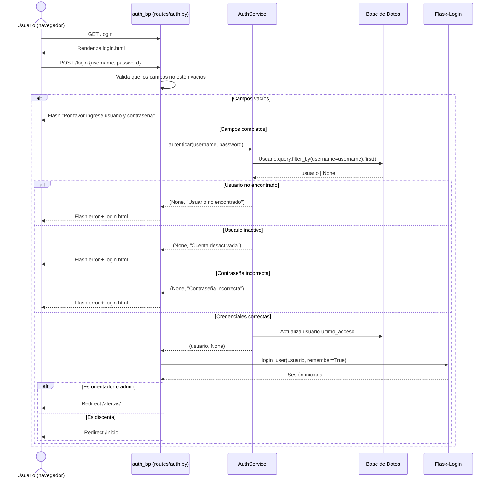

---

### 7.2 Registro de Discente

Describe el proceso de auto-registro de un nuevo discente.

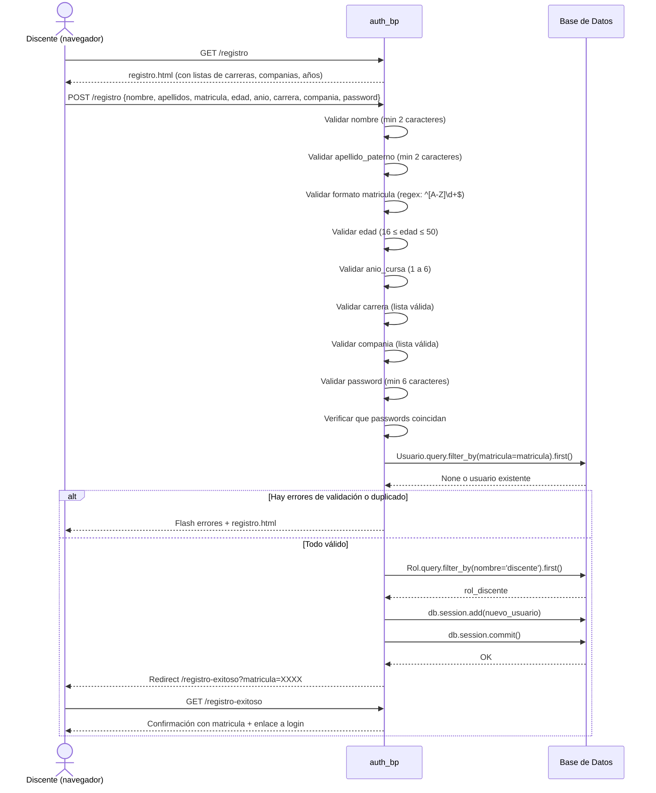

---

### 7.3 Responder Cuestionario y Generar Evaluación

Describe el flujo completo desde que el discente selecciona un cuestionario hasta que ve su resultado.

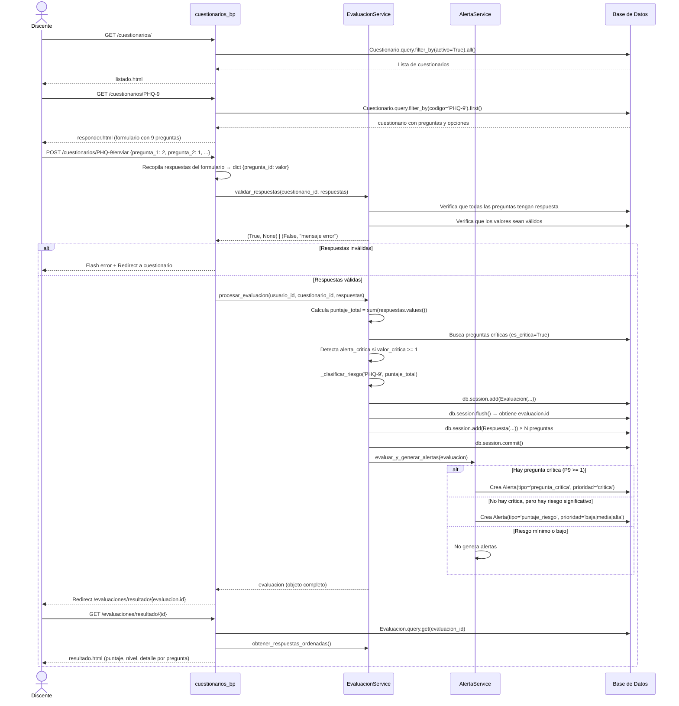

---

### 7.4 Generación Automática de Alertas

Detalla la lógica interna del servicio de alertas.

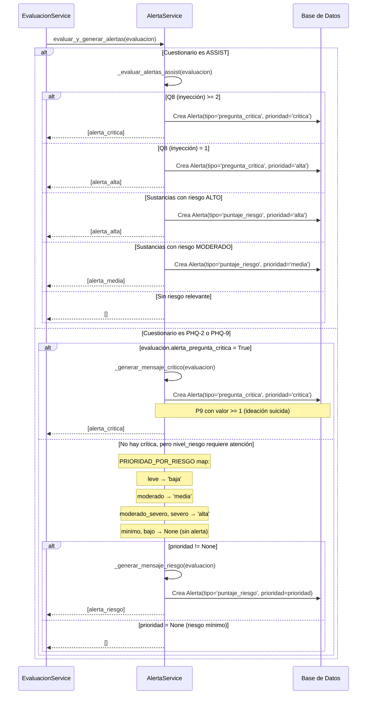

---

### 7.5 Atención de Alerta por Orientador

Flujo de revisión y cierre de una alerta por parte del orientador.

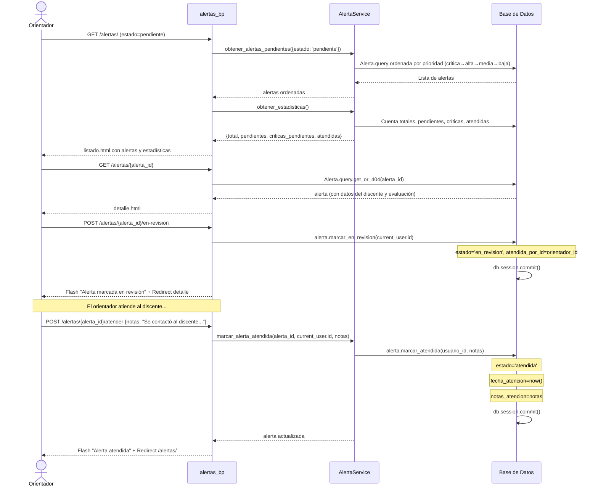

---

## 8. Diagrama de Actividades

### 8.1 Proceso de Evaluación PHQ-9

Describe el flujo completo de actividades del proceso de evaluación, desde la perspectiva del usuario.

```
[Inicio]
   |
   v
¿Usuario autenticado?
   |No                  |Sí
   v                    v
Redirect /login    ¿Es discente?
                        |No                      |Sí
                        v                        v
                   Puede ver cualquier    Solo sus propias
                   evaluación             evaluaciones
                        |_________________________|
                                   |
                                   v
                        Accede a /cuestionarios/
                                   |
                                   v
                        Selecciona cuestionario (PHQ-9)
                                   |
                                   v
                        Lee instrucciones
                                   |
                                   v
                        Responde pregunta 1
                                   |
                                   v
                        Responde pregunta 2
                                   |
                                  ...
                                   |
                                   v
                        Responde pregunta 9 (CRÍTICA)
                                   |
                                   v
                        Envía formulario (POST /enviar)
                                   |
                                   v
                        ¿Todas las preguntas respondidas?
                                |No          |Sí
                                v            v
                           Flash error   Valida valores
                           Redirect      (0-3 por pregunta)
                           cuestionario      |
                                             v
                                       ¿Valores válidos?
                                            |No     |Sí
                                            v       v
                                       Flash error  Calcula puntaje_total
                                       Redirect     = sum(respuestas)
                                                         |
                                                         v
                                                   Detecta P9
                                                   (es_critica=True)
                                                         |
                                                         v
                                                   Clasifica nivel_riesgo
                                                   PHQ-9: 0-4→minimo
                                                          5-9→leve
                                                         10-14→moderado
                                                         15-19→mod_severo
                                                         20-27→severo
                                                         |
                                                         v
                                                   Guarda Evaluacion
                                                   + N Respuestas
                                                         |
                                                         v
                                                   Genera alertas
                                                   (si aplica)
                                                         |
                                                         v
                                                   Redirect resultado
                                                         |
                                                         v
                                                   [Fin: Muestra resultado]
```

---

### 8.2 Clasificación de Nivel de Riesgo

Actividades del método `_clasificar_riesgo` según el tipo de cuestionario.

```
[Inicio: se recibe (codigo_cuestionario, puntaje)]
   |
   v
¿codigo == 'PHQ-2'?
   |Sí                     |No
   v                        v
¿puntaje >= 3?         ¿codigo == 'PHQ-9'?
   |Sí   |No                |Sí               |No
   v     v                  v                  v
retorna  retorna      ¿0 <= puntaje <= 4?  ¿codigo == 'ASSIST'?
'moderado' 'minimo'       |Sí  |No              |Sí      |No
                           v    v                v         v
                        retorna ¿5<=p<=9?     retorna  retorna
                        'minimo'  |Sí |No      'bajo'  'no_clasificado'
                                  v    v
                               retorna ¿10<=p<=14?
                               'leve'    |Sí  |No
                                         v    v
                                      retorna ¿15<=p<=19?
                                      'moderado' |Sí  |No
                                                 v    v
                                              retorna retorna
                                              'moderado_severo' 'severo'
```

---

## 9. Diagrama de Estados

### 9.1 Estados de una Alerta

Muestra el ciclo de vida completo de una alerta desde su creación hasta su cierre.

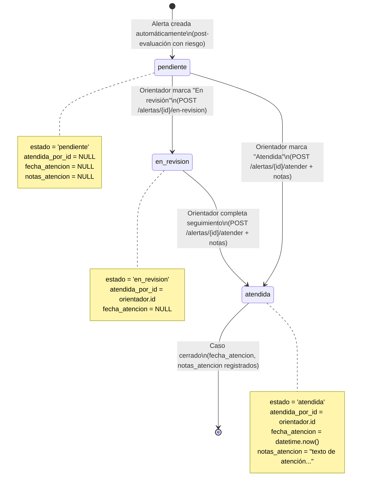

### Prioridades de alerta y su significado

| Prioridad | Color visual | Icono | Requiere |
|---|---|---|---|
| `critica` | Negro (dark) | `bi-exclamation-octagon-fill` | Atención INMEDIATA |
| `alta` | Rojo (danger) | `bi-exclamation-circle-fill` | Atención prioritaria |
| `media` | Amarillo (warning) | `bi-exclamation-triangle` | Atención pronta |
| `baja` | Azul claro (info) | `bi-info-circle` | Seguimiento normal |

---

### 9.2 Ciclo de Vida de una Evaluación

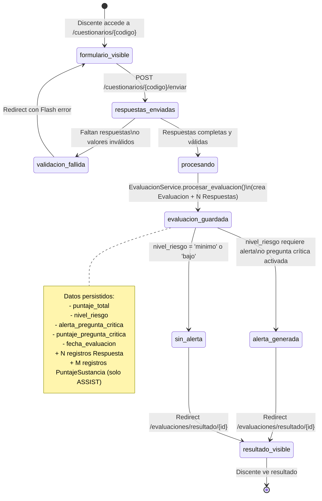

---

## 10. Diagrama de Paquetes

Muestra la organización modular del código fuente del proyecto.

```
psico_monitor/
│
├── app/                          ← Paquete principal
│   │
│   ├── __init__.py               ← Application Factory (create_app)
│   │                                Registra blueprints, inicializa extensiones
│   │
│   ├── config.py                 ← Configuraciones (dev/prod/test)
│   │
│   ├── models/                   ← Paquete de Modelos (Capa de Datos)
│   │   ├── __init__.py
│   │   ├── usuario.py            → Rol, Usuario
│   │   ├── cuestionario.py       → Cuestionario, Pregunta, OpcionRespuesta
│   │   ├── evaluacion.py         → Evaluacion, Respuesta, PuntajeSustancia
│   │   └── alerta.py             → Alerta
│   │
│   ├── services/                 ← Paquete de Servicios (Lógica de negocio)
│   │   ├── __init__.py
│   │   ├── auth_service.py       → AuthService
│   │   ├── evaluacion_service.py → EvaluacionService
│   │   └── alerta_service.py     → AlertaService
│   │
│   ├── routes/                   ← Paquete de Rutas (Controladores)
│   │   ├── __init__.py
│   │   ├── auth.py               → auth_bp      (/login, /logout, /registro)
│   │   ├── main.py               → main_bp      (/, /inicio)
│   │   ├── cuestionarios.py      → cuestionarios_bp (/cuestionarios/...)
│   │   ├── evaluaciones.py       → evaluaciones_bp  (/evaluaciones/...)
│   │   ├── alertas.py            → alertas_bp   (/alertas/...)
│   │   └── admin.py              → admin_bp     (/admin/...)
│   │
│   ├── utils/                    ← Utilidades transversales
│   │   ├── __init__.py
│   │   └── decorators.py         → @solo_orientador (control de acceso)
│   │
│   └── templates/                ← Vistas HTML (Jinja2)
│       ├── base.html
│       ├── auth/
│       ├── cuestionarios/
│       ├── evaluaciones/
│       ├── alertas/
│       └── admin/
│
├── data/                         ← Base de datos SQLite
│   └── mentis_cura.db
│
├── venv/                         ← Entorno virtual Python
│
└── requirements.txt              ← Dependencias del proyecto
```

### Dependencias entre paquetes

```
routes/auth.py
    → models/usuario.py
    → services/auth_service.py

routes/cuestionarios.py
    → models/cuestionario.py
    → services/evaluacion_service.py

routes/evaluaciones.py
    → models/evaluacion.py
    → models/usuario.py
    → services/evaluacion_service.py
    → utils/decorators.py

routes/alertas.py
    → models/alerta.py
    → models/usuario.py
    → services/alerta_service.py
    → utils/decorators.py

services/evaluacion_service.py
    → models/cuestionario.py
    → models/evaluacion.py
    → services/alerta_service.py       ← Dependencia entre servicios

services/alerta_service.py
    → models/alerta.py
    → models/evaluacion.py

services/auth_service.py
    → models/usuario.py
```

---

## 11. Ruta Ideal del Sistema

La **ruta ideal** (o _happy path_) describe la secuencia óptima de URLs y acciones que cada actor debe seguir para completar con éxito su tarea principal, sin errores ni desvíos. Es la referencia de diseño para verificar que el flujo de navegación es correcto y completo.

---

### 11.1 Ruta Ideal — Discente

Escenario: un discente nuevo se registra, inicia sesión y completa el cuestionario PHQ-9 que arroja un nivel de riesgo moderado.

```
PASO  MÉTODO  URL                                RESULTADO ESPERADO
────  ──────  ─────────────────────────────────  ─────────────────────────────────────────
  1   GET     /                                  → Redirect a /login (no autenticado)
  2   GET     /login                             → Muestra formulario de login
  3   GET     /registro                          → Muestra formulario de registro
  4   POST    /registro                          → Crea usuario discente en BD
                                                 → Redirect a /registro-exitoso?matricula=A12345
  5   GET     /registro-exitoso?matricula=A12345 → Página de confirmación con matrícula
  6   GET     /login                             → Formulario de login
  7   POST    /login {username: A12345, pwd: …}  → Autentica, crea sesión
                                                 → Redirect a /inicio (discente)
  8   GET     /inicio                            → Dashboard discente
                                                   (cuestionarios disponibles + historial vacío)
  9   GET     /cuestionarios/                    → Lista de cuestionarios activos
 10   GET     /cuestionarios/PHQ-9               → Formulario PHQ-9 con 9 preguntas
 11   POST    /cuestionarios/PHQ-9/enviar        → Valida respuestas
          {pregunta_X: valor, …}               → Calcula puntaje (ej: 12 → moderado)
                                                 → Guarda Evaluacion + 9 Respuestas
                                                 → Genera Alerta (prioridad: media)
                                                 → Redirect a /evaluaciones/resultado/{id}
 12   GET     /evaluaciones/resultado/{id}       → Resultado: puntaje=12, nivel=Moderado
                                                   detalle pregunta a pregunta
 13   GET     /evaluaciones/historial            → Lista de todas las evaluaciones propias
 14   GET     /logout                            → Cierra sesión → Redirect a /login
```

**Invariantes de la ruta ideal:**
- En el paso 4, el formato de matrícula debe ser `[A-Z]\d+` (ej: `A12345`).
- En el paso 7, el discente usa su matrícula como `username`.
- En el paso 11, todas las 9 preguntas deben tener valor entre 0 y 3.
- El sistema genera alerta automáticamente si `nivel_riesgo` ∈ `{leve, moderado, moderado_severo, severo}` o si la pregunta 9 tiene valor ≥ 1.

---

### 11.2 Ruta Ideal — Orientador

Escenario: el orientador inicia sesión, atiende la alerta generada por el discente del escenario anterior y consulta su historial.

```
PASO  MÉTODO  URL                                    RESULTADO ESPERADO
────  ──────  ─────────────────────────────────────  ─────────────────────────────────────────
  1   GET     /                                      → Redirect a /login
  2   GET     /login                                 → Formulario de login
  3   POST    /login {username: orientador, pwd: …}  → Autentica como orientador
                                                     → Redirect a /alertas/ (puede_ver_alertas)
  4   GET     /alertas/                              → Lista alertas pendientes ordenadas
                                                       por prioridad (critica→alta→media→baja)
                                                       Muestra estadísticas globales
  5   GET     /alertas/{alerta_id}                   → Detalle de la alerta:
                                                       discente, tipo, prioridad, mensaje,
                                                       enlace a la evaluación
  6   POST    /alertas/{alerta_id}/en-revision        → Alerta.estado = 'en_revision'
                                                     → Redirect a /alertas/{alerta_id}
  7   GET     /evaluaciones/resultado/{eval_id}      → Ve el resultado completo del discente
  8   GET     /evaluaciones/usuario/{usuario_id}     → Ve el historial completo del discente
  9   POST    /alertas/{alerta_id}/atender            → Alerta.estado = 'atendida'
          {notas: "Se contactó al discente…"}       → Registra fecha_atencion y notas
                                                     → Redirect a /alertas/
 10   GET     /alertas/?estado=atendida              → Verifica que la alerta aparece atendida
 11   GET     /alertas/discentes                     → Lista de todos los discentes registrados
 12   GET     /logout                                → Cierra sesión → Redirect a /login
```

**Invariantes de la ruta ideal:**
- Los pasos 4 al 11 están protegidos por `@login_required` + `@solo_orientador`. Sin el rol correcto, Flask retorna 403.
- El paso 9 es un `POST` (no `GET`) para evitar que la acción se ejecute accidentalmente al recargar la página.
- Las notas del paso 9 se persisten en `Alerta.notas_atencion` junto con `Alerta.atendida_por_id` = ID del orientador actual.

---

### 11.3 Mapa completo de URLs

Todas las rutas del sistema, agrupadas por Blueprint, con método HTTP, control de acceso y función que las maneja.

```
Blueprint: auth_bp  (sin prefijo)
─────────────────────────────────────────────────────────────────────
  GET/POST  /login                    → auth.login()           [público]
  GET       /logout                   → auth.logout()          [@login_required]
  GET/POST  /registro                 → auth.registro()        [público]
  GET       /registro-exitoso         → auth.registro_exitoso()  [público]

Blueprint: main_bp  (sin prefijo)
─────────────────────────────────────────────────────────────────────
  GET       /                         → main.index()           [público → redirect]
  GET       /inicio                   → main.inicio()          [@login_required]
                                        ┌─ discente  → inicio_discente.html
                                        └─ orientador/admin → inicio_orientador.html

Blueprint: cuestionarios_bp  (prefijo: /cuestionarios)
─────────────────────────────────────────────────────────────────────
  GET       /cuestionarios/           → cuestionarios.listado()  [@login_required]
  GET       /cuestionarios/<codigo>   → cuestionarios.ver()      [@login_required]
  POST      /cuestionarios/<codigo>/enviar → cuestionarios.enviar() [@login_required]

Blueprint: evaluaciones_bp  (prefijo: /evaluaciones)
─────────────────────────────────────────────────────────────────────
  GET       /evaluaciones/resultado/<id>   → evaluaciones.resultado()    [@login_required]
  GET       /evaluaciones/historial        → evaluaciones.historial()    [@login_required]
  GET       /evaluaciones/usuario/<id>     → evaluaciones.historial_usuario() [@login_required + @solo_orientador]

Blueprint: alertas_bp  (prefijo: /alertas)
─────────────────────────────────────────────────────────────────────
  GET       /alertas/                      → alertas.listado()           [@login_required + @solo_orientador]
  GET       /alertas/<id>                  → alertas.detalle()           [@login_required + @solo_orientador]
  POST      /alertas/<id>/atender          → alertas.atender()           [@login_required + @solo_orientador]
  POST      /alertas/<id>/en-revision      → alertas.en_revision()       [@login_required + @solo_orientador]
  GET       /alertas/discentes             → alertas.listado_discentes() [@login_required + @solo_orientador]

Blueprint: admin_bp  (prefijo: /admin)
─────────────────────────────────────────────────────────────────────
  GET       /admin/                        → admin.inicio()              [@login_required + @solo_orientador]
  GET/POST  /admin/usuarios/nuevo          → admin.nuevo_usuario()       [@login_required + @solo_orientador]
  GET/POST  /admin/usuarios/<id>/editar    → admin.editar_usuario()      [@login_required + @solo_orientador]
  POST      /admin/usuarios/<id>/toggle    → admin.toggle_usuario()      [@login_required + @solo_orientador]
```

### Diagrama de navegación (flujo de pantallas)

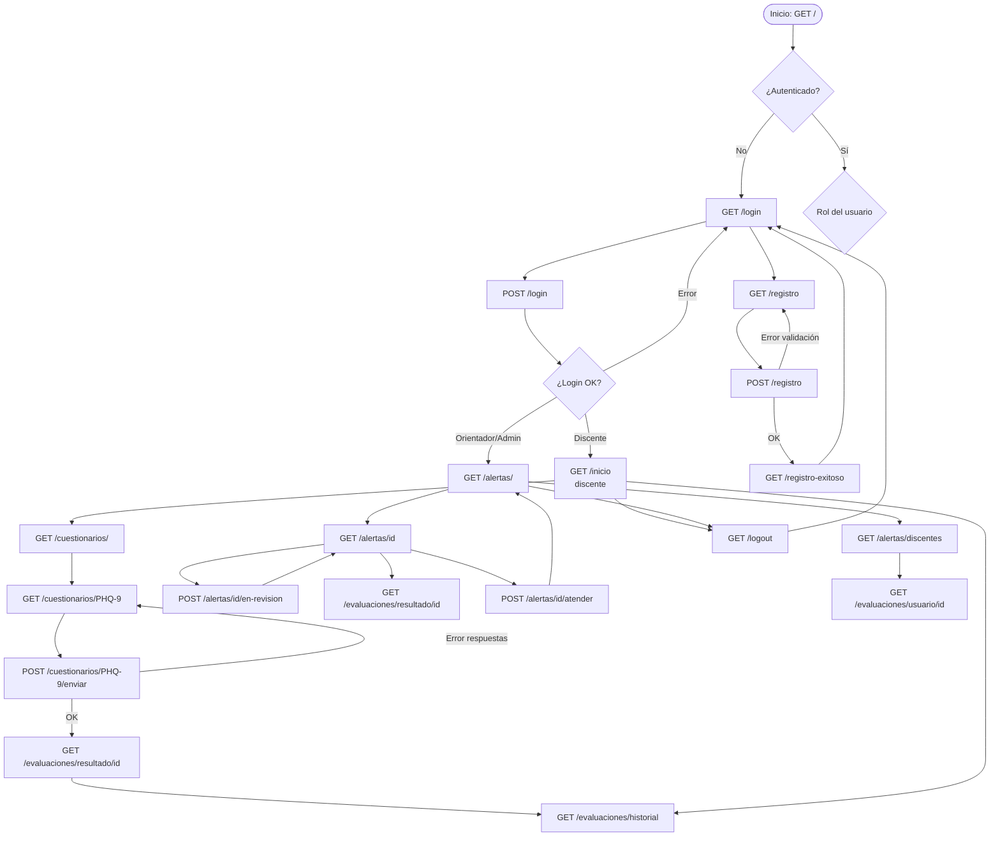

---

## Resumen ejecutivo

**MENTIS CURA** implementa una arquitectura MVC limpia con tres capas bien separadas:

1. **Modelos**: 9 entidades de base de datos que representan el dominio del problema (usuarios, roles, cuestionarios, preguntas, opciones, evaluaciones, respuestas, puntajes por sustancia y alertas).

2. **Servicios**: 3 clases de servicio sin estado que encapsulan toda la lógica de negocio compleja (autenticación, procesamiento de evaluaciones con cálculo de puntajes y clasificación de riesgo, y gestión del ciclo de vida de alertas).

3. **Rutas (Blueprints)**: 6 módulos de rutas HTTP organizados por dominio funcional, con control de acceso mediante decoradores (`@login_required`, `@solo_orientador`).

El flujo central del sistema es: **Discente responde cuestionario → EvaluacionService calcula puntaje y clasifica riesgo → AlertaService genera alertas automáticas si hay riesgo → Orientador revisa y atiende alertas.**

---

*Documento generado con Claude Code — Marzo 2026*
